# Radiomic carotid plaque features for cardiovascular risk prediction

[](https://doi.org/10.1016/j.ultrasmedbio.2026.05.006)


Analysis notebooks associated with:

> Ricky Hu, Ramtin Mojtahedi, Ergi Duli, Marie-France Hétu, Laura Mantella, Amber L. Simpson, Michael J. Blaha, Taylor Barwell, Kiera Liblik, Jasjit S. Suri, and Amer M. Johri. “Radiomic Carotid Plaque Features Integrated into Machine Learning Models for Cardiovascular Risk Prediction.” *Ultrasound in Medicine & Biology*, In Press, Corrected Proof, available online 12 June 2026. [https://doi.org/10.1016/j.ultrasmedbio.2026.05.006](https://doi.org/10.1016/j.ultrasmedbio.2026.05.006)

<!-- repository-guide:start -->
## At a glance

[Paper](https://doi.org/10.1016/j.ultrasmedbio.2026.05.006) · [All features](AllFeatures.ipynb) · [Clinical + imaging](ClinHistAndImaging.ipynb) · [Clinical](ClinHistOnly.ipynb) · [Imaging](ImagingOnly.ipynb) · [Radiomics + clinical](RadiomicsAndClinHist.ipynb) · [Radiomics + imaging](RadiomicsAndImaging.ipynb) · [Radiomics](RadiomicsOnly.ipynb) · [`CITATION.cff`](CITATION.cff)

### Dependency evidence

| Package | Role in the committed notebooks |
|---|---|
| `pandas` | CSV loading and result tables |
| `numpy` | Numerical arrays and aggregation |
| `scikit-learn` | Scaling, classifiers, stratified folds, ROC and classification metrics |
| `skrebate` | ReliefF feature ranking |
| `imbalanced-learn` | `RandomOverSampler` |
| `xgboost` | `XGBClassifier` |
| `matplotlib` | ROC and analysis plots |

No requirements file or package versions are supplied.

### Analysis flow represented by each feature-set notebook

```mermaid
flowchart LR
    A["One expected feature-set CSV<br/>(not included)"] --> B["Outcome: first column<br/>Features: remaining columns"]
    B --> C["Missing-value inspection"]
    C --> D["StandardScaler"]
    D --> E["ReliefF feature selection"]
    E --> F["RandomOverSampler"]
    F --> G["SVM · KNN · Random Forest · XGBoost"]
    G --> H["Stratified K-fold evaluation"]
    H --> I["ROC/AUC · precision · recall · F1 · accuracy"]
    I --> J["Plots and retained notebook outputs"]
```



> **Reproducibility boundary:** this diagram follows the committed cell order. Those cells fit scaling, feature selection, and oversampling before the manually iterated cross-validation splits. A fresh leakage-sensitive evaluation should place these operations inside each training fold and verify the intended procedure against the paper. Patient tables and upstream radiomic extraction are not included.
<!-- repository-guide:end -->

## Repository status

> **Important:** this repository is an archival analysis snapshot. It is **not a standalone reproducibility package**, and the notebooks cannot reproduce the paper from a fresh clone.

The repository contains seven Jupyter notebooks that compare clinical-history, focused vascular ultrasound imaging, and carotid-plaque radiomic feature sets. It does not include the patient-level input tables or the upstream data-processing pipeline.

Specifically:

- none of the seven CSV files expected by the notebooks is included;
- no raw or processed clinical data, ultrasound measurements, radiomic features, outcome records, data dictionary, or patient/split identifiers are included;
- the plaque segmentation, radiomic feature-extraction, manual-measurement, and table-construction code is absent;
- there is no requirements file, environment lockfile, container, or package-version record;
- notebook code uses fixed relative input and output filenames, while retained outputs expose paths from the original Windows environment; and
- no software license has been declared.

Treat these notebooks as a record of selected analysis steps, not as a validated risk calculator, clinical decision-support tool, or independently reproducible implementation.

## Repository map and required inputs

Each notebook expects its CSV in the repository’s working directory. The code treats the **first CSV column as the prediction outcome** and the remaining columns as numerical features.

| Notebook | Expected CSV, not included | Feature group represented |
|---|---|---|
| `AllFeatures.ipynb` | `allData.csv` | Clinical history, focused vascular ultrasound imaging, and radiomics |
| `ClinHistAndImaging.ipynb` | `clinHistAndImaging.csv` | Clinical history and imaging |
| `ClinHistOnly.ipynb` | `clinHistOnly.csv` | Clinical history only |
| `ImagingOnly.ipynb` | `imagingOnly.csv` | Imaging only |
| `RadiomicsAndClinHist.ipynb` | `radiomicsAndClinHist.csv` | Radiomics and clinical history |
| `RadiomicsAndImaging.ipynb` | `radiomicsAndImaging.csv` | Radiomics and imaging |
| `RadiomicsOnly.ipynb` | `radiomicsOnly.csv` | Radiomics only |
| `CITATION.cff` | — | Machine-readable citation metadata for the accompanying article |

The column names, units, missing-value conventions, inclusion criteria, and outcome coding cannot be recovered from the repository. Supplying unrelated CSVs with the same filenames is not sufficient to reproduce the published analysis.

## Analysis represented in the notebooks

Across the notebook variants, the committed cells include:

- CSV loading and basic missing-value inspection;
- standardization with scikit-learn;
- ReliefF feature ranking/selection;
- class oversampling with `RandomOverSampler`;
- support-vector machine, k-nearest-neighbor, random-forest, and XGBoost classifiers; and
- stratified cross-validation with ROC/AUC and classification metrics.

The notebooks contain exploratory and repeated cells, including model variants and retained outputs. They should not be interpreted as a clean, single-command implementation of the final statistical analysis without comparison to the paper and original analysis records.

## Environment and path assumptions

The notebooks import pandas, NumPy, scikit-learn, Matplotlib, scikit-rebate (`skrebate`), imbalanced-learn, and XGBoost. Exact versions are not recorded, and retained warnings indicate that the original environment used APIs that may now be deprecated.

Path-related limitations include:

- each notebook hard-codes one relative CSV filename listed above;
- several notebooks save plots as `allData.png`, so running them in the same directory can overwrite another notebook’s output;
- `ImagingOnly.ipynb` can also write `results_table.csv`; and
- stored cell outputs contain historical paths such as `C:\Users\mojta\...`. Those Windows paths are execution traces, not portable inputs.

## Clone for inspection

```bash
git clone https://github.com/Ramtin-Mojtahedi/AI-Radiomics-Carotid.git
cd AI-Radiomics-Carotid
```

A successful clone provides only the notebooks. To reconstruct an analysis environment, a researcher would need to:

1. obtain authorized access to the de-identified study table or approved equivalent data;
2. recover the data dictionary, outcome definition, feature provenance, inclusion criteria, and exact train/cross-validation design;
3. build the seven expected CSV views or deliberately update each notebook’s input path;
4. reconstruct and record compatible package versions;
5. verify preprocessing, feature-selection, oversampling, and evaluation order against the final paper; and
6. redirect each notebook’s outputs to a separate directory to prevent overwrites.

Do not upload patient-level or otherwise restricted data to a public fork.

## Data availability

The study reports 493 participants with five-year major adverse cardiovascular event outcomes. Those clinical inputs are not distributed here. The published article states that data are available upon reasonable request to Amer M. Johri; consult the article for the authoritative request route and applicable approvals.

## Citation

If these notebooks inform your work, cite the accompanying article:

```bibtex
@article{hu2026radiomic,
  author  = {Hu, Ricky and Mojtahedi, Ramtin and Duli, Ergi and Hétu, Marie-France and Mantella, Laura and Simpson, Amber L. and Blaha, Michael J. and Barwell, Taylor and Liblik, Kiera and Suri, Jasjit S. and Johri, Amer M.},
  title   = {Radiomic Carotid Plaque Features Integrated into Machine Learning Models for Cardiovascular Risk Prediction},
  journal = {Ultrasound in Medicine \& Biology},
  year    = {2026},
  note    = {In Press, Corrected Proof; available online 12 June 2026},
  doi     = {10.1016/j.ultrasmedbio.2026.05.006},
  url     = {https://doi.org/10.1016/j.ultrasmedbio.2026.05.006}
}
```

GitHub can also expose this citation through `CITATION.cff`.

## License and reuse

**No license file or software license grant is included.** The repository’s public visibility does not by itself grant permission to copy, modify, redistribute, or incorporate the notebooks into another project. Unless an exception in applicable law applies, obtain permission from the relevant rights holders before reuse.

For permissions, data access, or scientific questions, contact the authors through the published article or contact the repository owner.
